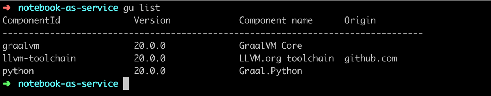
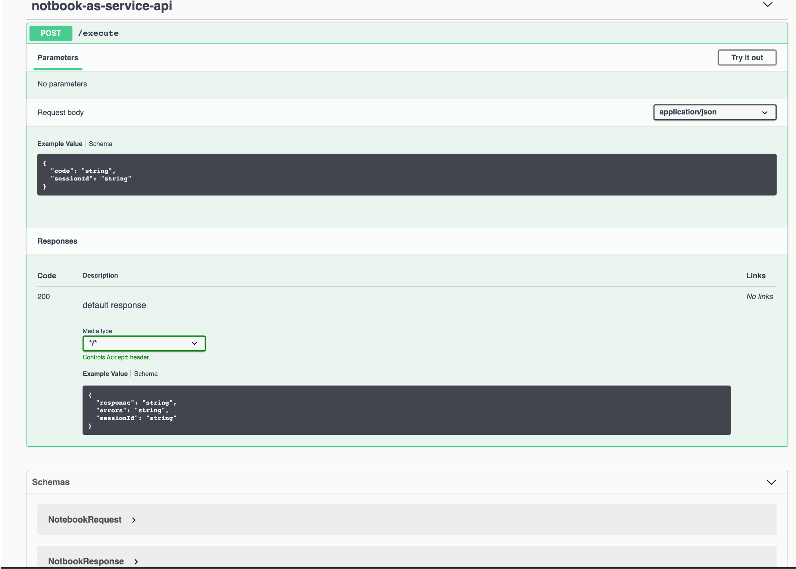

# Notebook As Service
Execute python code as a service
    
    
# Installation 

Clone project into a local folder.

```$shell 
$ git clone https://github.com/mgorav/notebook-as-service.git
```

## Maven Installation

### Maven 

Install Maven

### GraalVM 
Download and install Graal from  [GraalVM homepage](https://www.graalvm.org/). 
following instruciton at: [Getting Started with GraalVM](https://www.graalvm.org/docs/getting-started/). 


###Graal python installer
Download [GraalVM pyton](https://www.graalvm.org/docs/reference-manual/languages/python/)
```$shell
$ gu -c  -L install python-installable-svm-java8-darwin-amd64-20.0.0.jar
```

Verify python installation:

```$shell
$ gu -list
```



### Build and Run project 


````
$ mvn package -DskipTests
````

Time to play:

```
$ java -jar target/notebook-as-service-1.0.0-SNAPSHOT.jar
```

Play time...Hit the url:
```
http://localhost:6464/swagger-ui.html

```


### Example 1 simple python print

- Request Body :
```json
{
  "code": "%python print('Hello Graal')", 
  "sessionId": "graal-sessionId-1"
}
```

- Via curl :

```
$ curl -X POST  http://localhost:6464/execute  -d '{"code": "%python print(\"Hello Graal\")", "sessionId": "graal-sessionId-1"}'
```

``